# Your App's Name (e.g., MADTracking)

## Workspace

Github:

- Repository: https://github.com/stefaniasilivestru/MobileAppDevelopmentProject1
- Releases: https://github.com/stefaniasilivestru/MobileAppDevelopmentProject1/releases

Workspace: https://upm365.sharepoint.com/sites/MobileDevelopmentAlexeSilivestru/SitePages/Week-7.aspx .

## Description

Tripify is the perfect app for creating, managing, and exploring unique routes tailored to your interests. Whether you're a movie buff, a nature enthusiast, or simply seeking new adventures, Tripify empowers you to curate personalized journeys with ease.

With Tripify, you can effortlessly save, edit, and delete routes based on specific criteria, ensuring each excursion aligns perfectly with your preferences. Say goodbye to generic itineraries and hello to tailor-made experiences that cater to your passions. From strolling through the streets of classic films to reliving scenes from beloved TV shows, Tripify transforms ordinary outings into cinematic adventures.

Moreover, with Tripify you can check the weather forecast for your chosen route to ensure optimal conditions, and visualize your path on an interactive map for seamless navigation.

Tripify also fosters social connectivity by enabling authentication, route sharing with friends, and multilingual support for users (EN/ES for the moment). Additionally, the app values user feedback, offering a convenient avenue to share suggestions and enhancements via email.

In comparison to existing apps on the market, Tripify stands out for its specialized focus on movie and series filming locations, offering a unique niche that caters to entertainment enthusiasts.

## Screenshots and navigation

Include screenshots of the app in action. You can upload the images to GitHub and then reference them here using Markdown or HTML syntax:

<table>
  <tr>
    <td>
      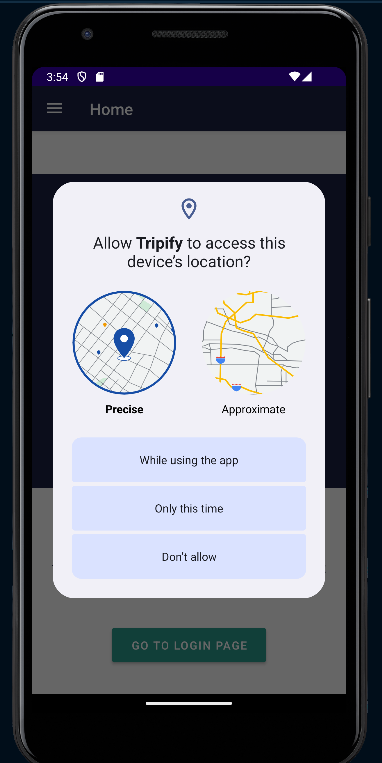
      <p align="center">Location request on home</p>
    </td>
    <td>
      
      <p align="center">Home Page</p>
    </td>
    <td>
      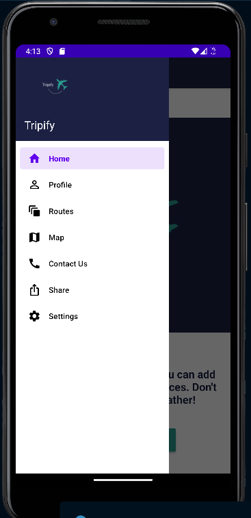
      <p align="center">Navigation Drawer Menu</p>
    </td>
  </tr>
  <tr>
    <td>
      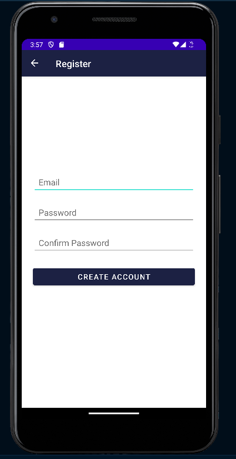
      <p align="center">Register user</p>
    </td>
    <td>
      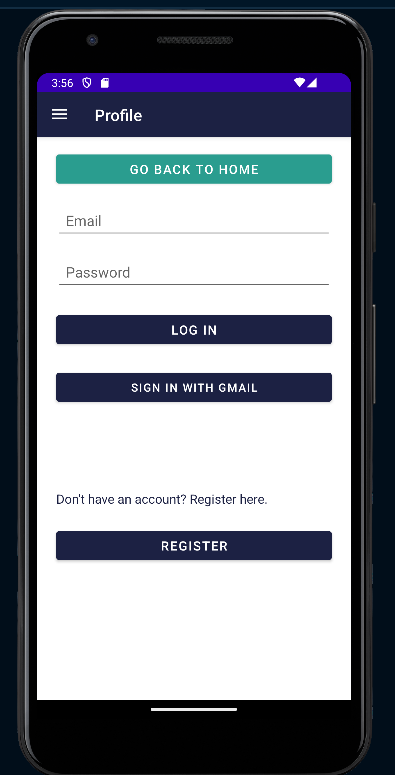
      <p align="center">Login user</p>
    </td>
    <td>
      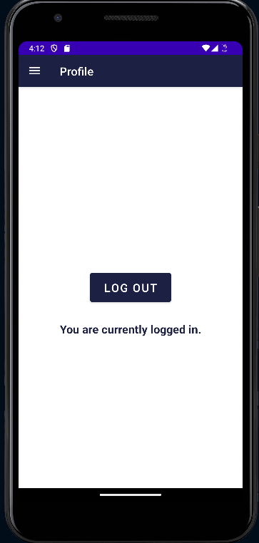
      <p align="center">Logout user</p>
    </td>
  </tr>
  <tr>
    <td>
      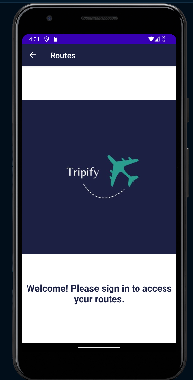
      <p align="center">Routes page when the user is not logged in</p>
    </td>
    <td>
      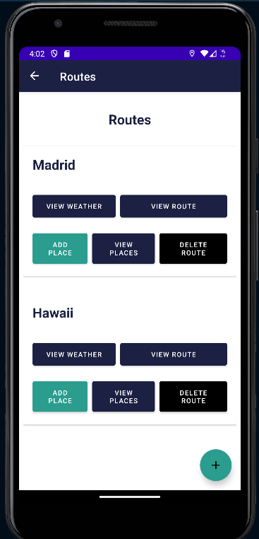
      <p align="center">Routes page</p>
    </td>
  </tr>
  <tr>
    <td>
      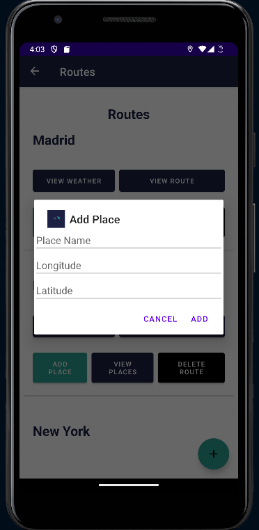
      <p align="center">Add place on route</p>
    </td>
    <td>
      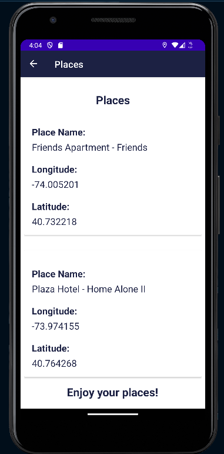
      <p align="center">Places on route</p>
    </td>
  </tr>
  <tr>
    <td>
      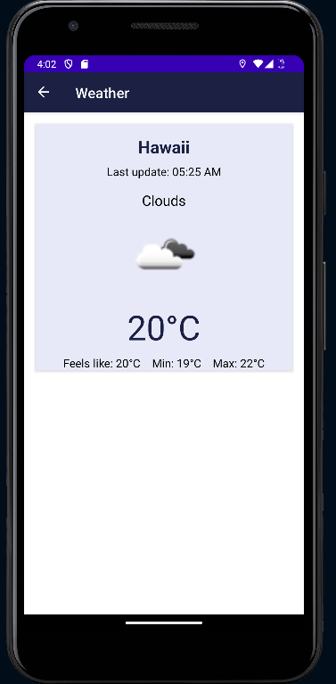
      <p align="center">See weather route</p>
    </td>
    <td>
      
      <p align="center">View route on map</p>
    </td>
  </tr>
  <tr>
    <td>
      
      <p align="center">Share content with friends</p>
    </td>
    <td>
      
      <p align="center">Send feedback on email</p>
    </td>
  </tr>
   <tr>
    <td>
      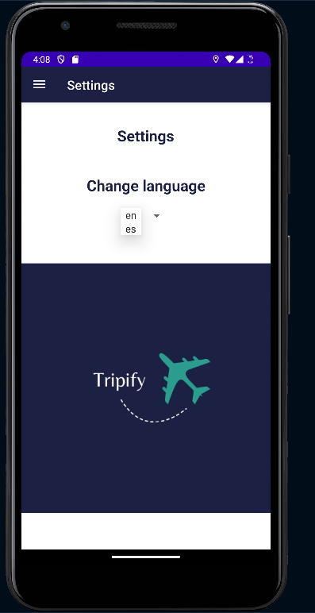
      <p align="center">Settings</p>
    </td>
    <td>
      
      <p align="center">Profile page in English</p>
    </td>
    <td>
      
      <p align="center">Profile page in Spanish</p>
    </td>
  </tr>
</table>

## Demo Video

Video demonstrating how the app works (Max 1 video of 1 minute), upload it to a platform like YouTube or Vimeo (it might also work with Stream) and link it here:  
<a href="www.urmeaza.com">
</a>

## Features

List the **functional** features of the app. For example:

- Search for common routes in Madrid.
- Filters by transport type.
- Interactive maps.
- Real-time traffic information.

List the **technical** features of the app. You might include specific references to source code
in your repo. For example:

- Persistence in csv/text file
- Persistence in shared preferences
- Persistence in Room database. Ref: [Source code](https://github.com/btabuenca/HelloWorldKt/blob/268a3367296238c76ec1baa18d0b5d268a49235f/app/src/main/java/es/upm/btb/helloworldkt/persistence/room/LocationEntity.kt#L6 "LocationEntity")
- Firebase Realtime database
- Firebase authentication
- Maps: Openstreetmaps or Google maps
- Resful APIs used (_e.g., Openwheathermaps https://openweathermap.org/api .Describe the api here_).
- Menu: _e.g., Toolbar_
- Images: _e.g. glide or picasso library_
- Sensors: _e.g., GPS coordinates, noise meter, light meter, compass, gyroscope, ..._
- ...

## How to Use

Provide instructions on how to get started with the app as user.

## Additional section

You might describe any additional section you might consider necessary. Remove this if not necessary.

## Participants

List of MAD developers:

- Name SecondName Member1 (emailmemmber1@alumunos.upm.es)
- Name SecondName Member1 (emailmemmber1@alumunos.upm.es)

Workload distribution between members: (Percentage member1 / Percentage member 2) . _Please only specify in case of unevenly balanced workload distribution long the project e.g., (60%/40%). If not specified 50%/50% will be assumed_

```bash
you might include references or commands if necessary
```
