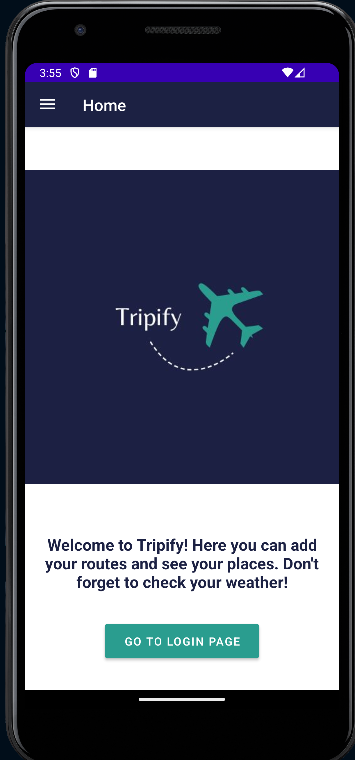
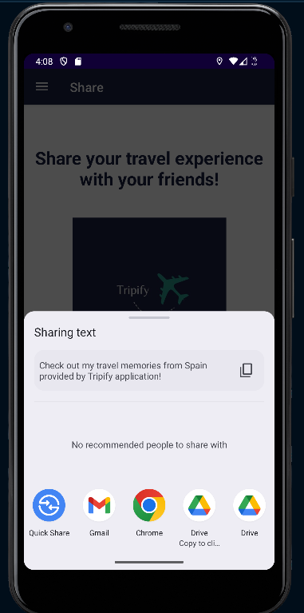
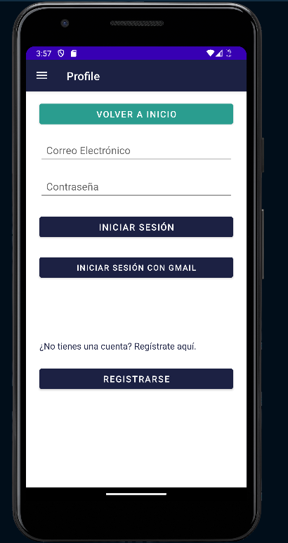

# Tripify

## Workspace

Github:

- Repository: https://github.com/stefaniasilivestru/MobileAppDevelopmentProject1
- Releases: https://github.com/stefaniasilivestru/MobileAppDevelopmentProject1/releases

Workspace: https://upm365.sharepoint.com/sites/MobileDevelopmentAlexeSilivestru/SitePages/Week-7.aspx .

## Description

Tripify is the perfect app for creating, managing, and exploring unique routes tailored to your interests. Whether you're a movie buff, a nature enthusiast, or simply seeking new adventures, Tripify empowers you to curate personalized journeys with ease.

With Tripify, you can effortlessly save, edit, and delete routes based on specific criteria, ensuring each excursion aligns perfectly with your preferences. Say goodbye to generic itineraries and hello to tailor-made experiences that cater to your passions. From strolling through the streets of classic films to reliving scenes from beloved TV shows, Tripify transforms ordinary outings into cinematic adventures.

Moreover, with Tripify you can check the weather forecast for your chosen route to ensure optimal conditions, and visualize your path on an interactive map for seamless navigation.

Tripify also fosters social connectivity by enabling authentication, route sharing with friends, and multilingual support for users (EN/ES for the moment). Additionally, the app values user feedback, offering a convenient avenue to share suggestions and enhancements via email.

In comparison to existing apps on the market, Tripify stands out for its specialized focus on movie and series filming locations, offering a unique niche that caters to entertainment enthusiasts.

## Screenshots and navigation

Include screenshots of the app in action. You can upload the images to GitHub and then reference them here using Markdown or HTML syntax:

<table>
  <tr>
    <td>
      
      <p align="center">Location request on home</p>
    </td>
    <td>
      
      <p align="center">Home Page</p>
    </td>
    <td>
      
      <p align="center">Navigation Drawer Menu</p>
    </td>
  </tr>
  <tr>
    <td>
      
      <p align="center">Register user</p>
    </td>
    <td>
      
      <p align="center">Login user</p>
    </td>
    <td>
      
      <p align="center">Logout user</p>
    </td>
  </tr>
  <tr>
    <td>
      
      <p align="center">Routes page when the user is not logged in</p>
    </td>
    <td>
      
      <p align="center">Routes page</p>
    </td>
  </tr>
  <tr>
    <td>
      
      <p align="center">Add place on route</p>
    </td>
    <td>
      
      <p align="center">Places on route</p>
    </td>
  </tr>
  <tr>
    <td>
      
      <p align="center">See weather route</p>
    </td>
    <td>
      
      <p align="center">View route on map</p>
    </td>
  </tr>
  <tr>
    <td>
      
      <p align="center">Share content with friends</p>
    </td>
    <td>
      
      <p align="center">Send feedback on email</p>
    </td>
  </tr>
   <tr>
    <td>
      
      <p align="center">Settings</p>
    </td>
    <td>
      
      <p align="center">Profile page in English</p>
    </td>
    <td>
      
      <p align="center">Profile page in Spanish</p>
    </td>
  </tr>
</table>

## Demo Video

Video demonstrating how the app works (Max 1 video of 1 minute), upload it to a platform like YouTube or Vimeo (it might also work with Stream) and link it here:  
<a href="https://upm365-my.sharepoint.com/:v:/g/personal/stefania_silivestru_alumnos_upm_es/EbT05Rg9C1hMm-jWP7HQSoYB0bMt2Y5qxVrDe_6t7AQ33A?e=bW4qHa&nav=eyJyZWZlcnJhbEluZm8iOnsicmVmZXJyYWxBcHAiOiJTdHJlYW1XZWJBcHAiLCJyZWZlcnJhbFZpZXciOiJTaGFyZURpYWxvZy1MaW5rIiwicmVmZXJyYWxBcHBQbGF0Zm9ybSI6IldlYiIsInJlZmVycmFsTW9kZSI6InZpZXcifX0%3D">
</a>

## Features

List the **functional** features of the app.

- Add routes and places using a specific criteria (e.g in our demo: routes in cities where famous movies and series were filmed)
- Display route on map
- Change language app
- List your places
- Delete and edit route
- See weather for a specific location

List the **technical** features of the app.

- Persistence in csv/text file
- Work with Fragments instead of Activities
- Navigation between fragments using navigation components
- Data binding, View binding (View Model) and LiveData (features that allows us to write code easily that interacts with the view)
- Use of RecyclerView
- Persistence in Shared Preferences (routeName and routeId)
- Persistence in Room database. (e.g: For learning purposes database for users and login/logout/register functionality that was described in previous releases, but migrate the idea using Firebase Auth later.)
- Firebase Realtime database
- Firebase Authentication
- Maps: OpenStreetMaps
- Restful APIs used (_e.g., Openwheathermaps https://openweathermap.org/api .Retrieve weather information data based on specific location_).
- Menu: _e.g., Navigation Drawer Menu_
- Images: _e.g. Picasso library_
- Test API: Postman


## How to Use

Provide instructions on how to get started with the app as user.
- Create an account using Email & Password or Sign up by Gmail
- Log in into your account
- Add a route by typing the city where the route will be located
- Choose your niche route (eg: route where famous movies were filmed)
- Add places
- Choose what actions to perform: see weather details, see route on map, delete your route
- If needed, change your app language
- If needed, share your feedback on Gmail to the creators of the app
- If needed, tell your friends about your routes

## Additional Information

The routes.txt file has some tests to check the functionality of the app.


## Participants

List of MAD developers:

- Stefania Silivestru Member1 (stefania.silivestru@alumunos.upm.es)
- Mihai-Victor Alexe Member2 (mihai-victor.alexe@alumunos.upm.es)

```bash
you might include references or commands if necessary
```
